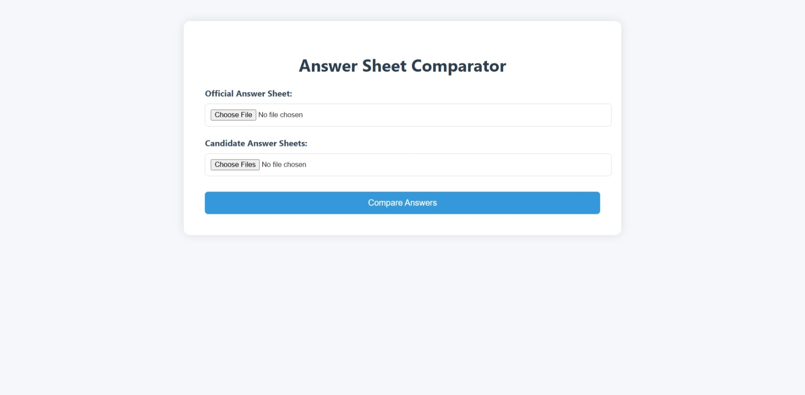

# 📝 Answer Sheet Comparator

A Flask-based web application for automatically comparing scanned answer sheets with an official answer key. Ideal for grading bubble sheets or MCQ-based assessments.

---


[https://lor.pythonanywhere.com]

## 🚀 Features

- Upload an official answer sheet and multiple candidate answer sheets
- Detect filled circles using OpenCV
- Compare answers and count:
  - ✅ Correct answers
  - ❌ Incorrect answers
  - ⭕ Unanswered questions
- Responsive frontend with loading spinner and clean results display

---

## 🛠️ Tech Stack

- **Backend:** Python, Flask, OpenCV, NumPy
- **Frontend:** HTML, CSS, Vanilla JS
- **Extras:** Flask-CORS, Secure file uploads

---

## 📂 Project Structure

```
├── flask_app.py                  # Flask backend
├── templates/
│   └── index.html          # Frontend HTML
├── uploads/                # Uploaded image storage (auto-created)
├── README.md               # You're here!
```

---

## ⚙️ Setup Instructions

### 1. Clone the Repository

```bash
git clone https://github.com/your-username/answer-sheet-comparator.git
cd answer-sheet-comparator
```

### 2. Create a Virtual Environment & Install Dependencies

```bash
python -m venv venv
source venv/bin/activate  # Windows: venv\Scripts\activate
pip install -r requirements.txt
```

If you don't have a `requirements.txt` yet, create one with:

```txt
numpy==2.2.4
opencv-python==4.11.0.86
Flask==3.1.0
flask-cors==5.0.1
```

### Before Running the file change base url in html to [http://127.0.0.1:5000]

### and comment the cors line

### 3. Run the App

```bash
python flask_app.py
```

Then open your browser to [http://127.0.0.1:5000](http://127.0.0.1:5000)

---

## 🧪 API Endpoints

### `POST /upload_files`

Uploads the official and candidate answer sheets.

### `POST /compare_answers`

Returns the comparison results with:

- `correct_answers`
- `incorrect_answers`
- `total_questions`

---


## 🧑‍💻 Author

Built with ❤️ by [Lokesh Rathi]

---


